# Sareine Craft — Full Website Audit

## Audit Information
- Audit date: 2026-09-28
- Framework: Next.js 16.3.5 App Router with React 19.2.8
- Rendering architecture: static public pages, SSG craft collection detail pages, one dynamic empty event detail route, client-side interactive headers/events/lightbox
- Styling system: Tailwind CSS v4 via `@import "tailwindcss"`, global CSS variables, utility classes, and CSS Modules
- Language: TypeScript / TSX
- Scope: repository audit of `src/`, `public/`, app routes, components, data files, configuration, assets, navigation, UX, SEO, accessibility, performance, API readiness, screenshots, and build/lint verification

## Executive Summary

The Sareine Craft website is a polished visual Next.js App Router project with a strong brand direction, centralized static data for most public content, and a production build that completes successfully. The strongest implementation areas are the public homepage, craft collection routing, global brand tokens, image-heavy editorial sections, and the reusable site data/navigation layer.

The weakest areas are launch completeness and route consistency. Several real routes render `null`: `/contact`, `/privacy`, `/terms`, `/cookies`, `/events/[slug]`, all auth routes, and all admin routes. These routes build successfully, but users and crawlers receive blank pages. Footer legal links therefore point to empty legal pages, and the header/footer expose `/contact` indirectly only through the footer contact label context rather than a complete contact page.

The public experience currently concentrates on three meaningful content pages: `/`, `/events`, and `/craft`, plus `/about` and seven craft collection pages. Events are section-based only; there are event category anchors but no linked event detail pages. Craft detail pages are more mature: slugs are generated from `craftCollections`, metadata is generated per collection, and invalid craft collection slugs are excluded with `dynamicParams = false`.

Severity summary:

| Area | Severity | Summary |
|---|---:|---|
| Public visual direction | GOOD | Strong premium/artisanal identity with plum, gold, ivory, editorial imagery, and consistent tone. |
| Build health | GOOD | `npm run build` and `npm run lint` pass. |
| Empty public/legal routes | HIGH | Linked legal pages and contact page exist but return `null`. |
| Empty auth/admin/event detail routes | MEDIUM | Real routable URLs exist with no UI, auth, or guard. |
| Navigation clarity | MEDIUM | Header/footer navigation is stable, but event cards all route to `/events` rather than category anchors or details. |
| Data architecture | GOOD | Site, navigation, home, events, about, craft, and collections are mostly centralized. |
| API readiness | MEDIUM | Static data is typed, but content is still imported directly into pages/components and several record arrays are empty. |
| Accessibility | MEDIUM | Good alt text and focus outlines exist; lightbox focus trapping, empty route semantics, hidden scrollbars, and decorative full-page screenshots reveal risks. |
| SEO | MEDIUM | Root/craft/events/about metadata exists; many pages inherit generic or empty metadata and blank pages are indexable unless controlled elsewhere. |
| Performance | MEDIUM | Next Image is used heavily, but assets include large PNG/JPEG files and many above-the-fold/client sections. |

## Table of Contents

- [Project Architecture Map](#project-architecture-map)
- [Route Inventory](#route-inventory)
- [Internal Link Inventory](#internal-link-inventory)
- [Visual Site Map](#visual-site-map)
- [Page-to-Page Navigation Map](#page-to-page-navigation-map)
- [Screenshots](#screenshots)
- [Page-by-Page Visual Audit](#page-by-page-visual-audit)
- [Homepage Deep Audit](#homepage-deep-audit)
- [Events Page Deep Audit](#events-page-deep-audit)
- [Crafts Page Deep Audit](#crafts-page-deep-audit)
- [Global Component Audit](#global-component-audit)
- [Design System Audit](#design-system-audit)
- [Brand Consistency](#brand-consistency)
- [Responsive Audit](#responsive-audit)
- [Image / Asset Audit](#image--asset-audit)
- [Data Architecture Audit](#data-architecture-audit)
- [API-Readiness Audit](#api-readiness-audit)
- [Accessibility Audit](#accessibility-audit)
- [SEO Audit](#seo-audit)
- [Performance Audit](#performance-audit)
- [Dependency Audit](#dependency-audit)
- [Dead Code / Unused Page Audit](#dead-code--unused-page-audit)
- [User Journey Analysis](#user-journey-analysis)
- [Conversion Audit](#conversion-audit)
- [Full Website Relationship Diagram](#full-website-relationship-diagram)
- [Issue Register](#issue-register)
- [Prioritized Roadmap](#prioritized-roadmap)
- [Final Assessment](#final-assessment)

## Project Architecture Map

```text
Sareine Website
|
├── src/
│   ├── app/
│   │   ├── layout.tsx                    # Root layout, fonts, global metadata
│   │   ├── globals.css                   # Tailwind import, tokens, typography utilities, scroll animations
│   │   ├── (public)/
│   │   │   ├── layout.tsx                # PublicHeader + main + PublicFooter + FloatingWhatsApp
│   │   │   ├── page.tsx                  # Homepage
│   │   │   ├── events/page.tsx           # Events experience
│   │   │   ├── events/[slug]/page.tsx    # Empty event detail route
│   │   │   ├── craft/page.tsx            # Craft landing page
│   │   │   ├── craft/[slug]/page.tsx     # SSG craft collection details
│   │   │   ├── about/page.tsx            # About page
│   │   │   ├── contact/page.tsx          # Empty route
│   │   │   ├── privacy/page.tsx          # Empty legal route
│   │   │   ├── terms/page.tsx            # Empty legal route
│   │   │   └── cookies/page.tsx          # Empty legal route
│   │   ├── (auth)/                       # Empty auth routes
│   │   └── (admin)/                      # Empty admin routes
│   │
│   ├── components/
│   │   ├── public/                       # Header, footer, floating WhatsApp, project CTA
│   │   ├── home/                         # Homepage sections, mostly CSS Modules
│   │   ├── events/                       # Events hero, chapters, lightbox, service process
│   │   ├── craft/                        # Craft landing/detail sections
│   │   ├── about/                        # About page experience
│   │   └── ui/                           # Button, Container, Section, SectionHeader
│   │
│   ├── data/
│   │   ├── site.ts                       # Brand/contact/address/logo data
│   │   ├── navigation.ts                 # Header/footer/legal nav
│   │   ├── social.ts                     # Social URLs
│   │   ├── home.ts                       # Homepage content and CTAs
│   │   ├── events.ts                     # Events content, categories, service process
│   │   ├── craft-page.ts                 # Craft landing content
│   │   ├── craft-collections.ts          # Craft collection detail data
│   │   ├── craft.ts                      # Empty legacy/general craft records
│   │   └── testimonials.ts               # Empty testimonials array
│   │
│   ├── lib/
│   │   ├── whatsapp.ts                   # WhatsApp URL helper
│   │   └── navigation.ts                 # Re-exports navigation
│   │
│   └── types/                            # Shared data contracts
│
├── public/
│   ├── brand/                            # Logo assets
│   └── images/                           # Home, event, craft imagery
│
├── scripts/
│   └── optimize-event-images.mjs         # HEIC/image optimization workflow
│
├── next.config.ts                        # Image config, React compiler
├── package.json                          # Scripts and dependencies
├── tsconfig.json                         # Strict TS, @/* alias
├── eslint.config.mjs                     # Next core-web-vitals + TS
└── postcss.config.mjs                    # Tailwind CSS v4 PostCSS plugin
```

Important architecture notes:

| Area | Observation |
|---|---|
| Route groups | Public, auth, and admin are separated with App Router route groups. Only public pages have a shared header/footer layout. |
| Styling | The code mixes global Tailwind utilities, CSS Modules, and hardcoded arbitrary values. This gives flexibility but creates consistency risk. |
| Data | Most public copy/images/CTAs are centralized in `src/data`, which is a strong base for future CMS/API migration. |
| Detail pages | Craft collections have real SSG detail routes; event details are present but empty. |
| Features/services | `src/features` only contains `.DS_Store`; `src/services` exists but no files were found. |

## Route Inventory

Build verification (`npm run build`) reported these routes:

| Route | Page | Source | Purpose | Linked From | Type | Status |
|---|---|---|---|---|---|---|
| `/` | Home | `src/app/(public)/page.tsx` | Main landing page | Header, footer, logo | PUBLIC | Active |
| `/about` | About | `src/app/(public)/about/page.tsx` | Brand/story/process | Header, footer, CTAs | PUBLIC | Active |
| `/events` | Events | `src/app/(public)/events/page.tsx` | Event services and categories | Header, footer, homepage, about | PUBLIC | Active |
| `/events/[slug]` | Event detail | `src/app/(public)/events/[slug]/page.tsx` | Intended event detail | Not meaningfully linked | PUBLIC / DYNAMIC | Empty route |
| `/craft` | Craft | `src/app/(public)/craft/page.tsx` | Craft collections overview | Header, footer, homepage, about | PUBLIC | Active |
| `/craft/bougies-gourmandes` | Craft collection | `src/app/(public)/craft/[slug]/page.tsx` | Collection detail | `/craft` cards | PUBLIC / SSG | Active |
| `/craft/princesses` | Craft collection | `src/app/(public)/craft/[slug]/page.tsx` | Collection detail | `/craft` cards | PUBLIC / SSG | Active |
| `/craft/silhouettes-robes` | Craft collection | `src/app/(public)/craft/[slug]/page.tsx` | Collection detail | `/craft` cards | PUBLIC / SSG | Active |
| `/craft/oursons-decoratifs` | Craft collection | `src/app/(public)/craft/[slug]/page.tsx` | Collection detail | `/craft` cards | PUBLIC / SSG | Active |
| `/craft/ourson-bleu` | Craft collection | `src/app/(public)/craft/[slug]/page.tsx` | Collection detail | `/craft` cards | PUBLIC / SSG | Active |
| `/craft/anges` | Craft collection | `src/app/(public)/craft/[slug]/page.tsx` | Collection detail | `/craft` cards | PUBLIC / SSG | Active |
| `/craft/fleurs-sculptees` | Craft collection | `src/app/(public)/craft/[slug]/page.tsx` | Collection detail | `/craft` cards | PUBLIC / SSG | Active |
| `/contact` | Contact | `src/app/(public)/contact/page.tsx` | Intended contact page | Not in main nav | PUBLIC | Empty route |
| `/privacy` | Privacy | `src/app/(public)/privacy/page.tsx` | Legal page | Footer legal nav | LEGAL | Empty linked route |
| `/terms` | Terms | `src/app/(public)/terms/page.tsx` | Legal page | Footer legal nav | LEGAL | Empty linked route |
| `/cookies` | Cookies | `src/app/(public)/cookies/page.tsx` | Legal page | Footer legal nav | LEGAL | Empty linked route |
| `/login` | Login | `src/app/(auth)/login/page.tsx` | Intended auth | Direct URL only | AUTH | Empty route |
| `/forgot-password` | Forgot password | `src/app/(auth)/forgot-password/page.tsx` | Intended auth | Direct URL only | AUTH | Empty route |
| `/reset-password` | Reset password | `src/app/(auth)/reset-password/page.tsx` | Intended auth | Direct URL only | AUTH | Empty route |
| `/admin` | Admin | `src/app/(admin)/admin/page.tsx` | Intended dashboard | Direct URL only | ADMIN | Empty, unguarded route |
| `/admin/events` | Admin events | `src/app/(admin)/admin/events/page.tsx` | Intended admin | Direct URL only | ADMIN | Empty, unguarded route |
| `/admin/inquiries` | Admin inquiries | `src/app/(admin)/admin/inquiries/page.tsx` | Intended admin | Direct URL only | ADMIN | Empty, unguarded route |
| `/admin/media` | Admin media | `src/app/(admin)/admin/media/page.tsx` | Intended admin | Direct URL only | ADMIN | Empty, unguarded route |
| `/admin/products` | Admin products | `src/app/(admin)/admin/products/page.tsx` | Intended admin | Direct URL only | ADMIN | Empty, unguarded route |
| `/admin/projects` | Admin projects | `src/app/(admin)/admin/projects/page.tsx` | Intended admin | Direct URL only | ADMIN | Empty, unguarded route |
| `/admin/settings` | Admin settings | `src/app/(admin)/admin/settings/page.tsx` | Intended admin | Direct URL only | ADMIN | Empty, unguarded route |
| `/_not-found` | Not found | generated by Next | Error route | Framework | UTILITY | Generated |

Evidence:

- Empty public/legal/event detail files return `null` in `src/app/(public)/contact/page.tsx`, `privacy/page.tsx`, `terms/page.tsx`, `cookies/page.tsx`, and `events/[slug]/page.tsx`.
- Empty admin/auth routes return `null` in `src/app/(admin)/admin/**/page.tsx` and `src/app/(auth)/**/page.tsx`.
- Craft detail paths are generated from `craftCollections` in `src/app/(public)/craft/[slug]/page.tsx`.

## Internal Link Inventory

| Source Page | UI Element | Destination | Type | Status | Notes |
|---|---|---|---|---|---|
| Global public layout | Header logo | `/` | Internal | Active | Uses `PublicHeader`. |
| Global public layout | Header nav | `/`, `/craft`, `/events`, `/about` | Internal | Active | Source data: `src/data/navigation.ts`. |
| Global public layout | Header project CTA | WhatsApp project URL | External | Active | Generated by `getWhatsAppHref`. |
| Global public layout | Header social icon | Instagram | External | Active | Facebook/TikTok are null and hidden/disabled depending section. |
| Global public layout | Mobile menu quick links | `/craft`, `/events` | Internal | Active | Present in `PublicHeader`. |
| Global public layout | Floating WhatsApp | `https://wa.me/212607306666` | External | Active | Global conversion. |
| Footer | Logo | `/` | Internal | Active | Footer brand block. |
| Footer | Explore nav | `/`, `/craft`, `/events`, `/about` | Internal | Active | Mirrors header nav. |
| Footer | Legal nav | `/privacy`, `/cookies`, `/terms` | Internal | Broken content | Routes exist but are blank. |
| Footer | Contact WhatsApp | `https://wa.me/212607306666` | External | Active | Only configured contact method. |
| Footer | Instagram | Instagram URL | External | Active | Configured in `src/data/social.ts`. |
| Footer | Project CTA | WhatsApp project URL | External | Active | Good direct conversion. |
| Home hero | Primary CTA | `/craft` | Internal | Active | Clear craft path. |
| Home hero | Secondary CTA | `/events` | Internal | Active | Clear event path. |
| Home services | Section CTA | `/events` | Internal | Active | Broad services CTA. |
| Home services cards | Cards visually look navigational | Card `href` values exist in data | UX issue | Cards are rendered as `article`, not links, in `ServicesSection`. |
| Home event categories | Cards | `/events` | Internal | Active but imprecise | All category cards route to `/events`, not category anchors. |
| Home process | CTA | WhatsApp project URL | External | Active | Direct conversion. |
| Home craft highlight | CTA | `/craft` | Internal | Active | Clear craft path. |
| Home final project section | CTA | WhatsApp project URL | External | Active | Direct conversion. |
| Home final project section | WhatsApp CTA | WhatsApp project URL | External | Duplicate | Two CTAs in same section lead to same destination. |
| Events hero | Primary CTA | `#baby-shower` | Anchor | Active | Scrolls into first event category. |
| Events category CTA | Buttons | WhatsApp event URL | External | Active | Every event category converts to WhatsApp. |
| Events lightbox images | Image buttons | Lightbox state | UI action | Active | Not navigational. |
| Events service process | No final CTA | None | UX issue | Data has `primaryCta`, component does not render it. |
| Craft hero | CTA | `#creations` | Anchor | Active | Scroll to collections. |
| Craft collection cards | Cards | `/craft/{slug}` | Internal | Active | 7 generated collection pages. |
| Craft story | CTA | `/about` | Internal | Active | Good brand-deepening route. |
| Craft collection detail | Back link | `/craft` | Internal | Active | Good return path. |
| Craft collection detail | Hero CTA | `#modeles` | Anchor | Active | Scroll to models. |
| About pillars | CTAs | `/events`, `/craft` | Internal | Active | Clear split between services. |
| About final CTA | Primary | WhatsApp project URL | External | Active | Conversion. |
| About final CTA | Secondary | `/events` | Internal | Active | Service discovery. |

Broken/unhelpful link findings:

- Footer legal links route to pages that render `null`.
- `/contact` exists but renders `null`; it is not used as the primary conversion path.
- Event category cards from the homepage route only to `/events`; they do not deep-link to `#baby-shower`, `#anniversaire`, `#remise-de-diplomes`, or `#evenements-prives`.
- `EventNavigation` exists as a category anchor index but is not imported into `EventsExperience`, so users do not currently get the sticky event index.

## Visual Site Map

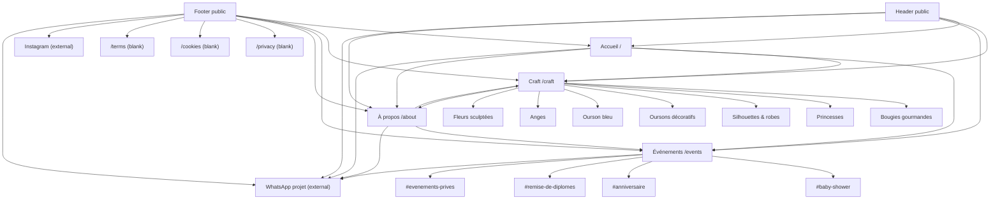

## Page-to-Page Navigation Map

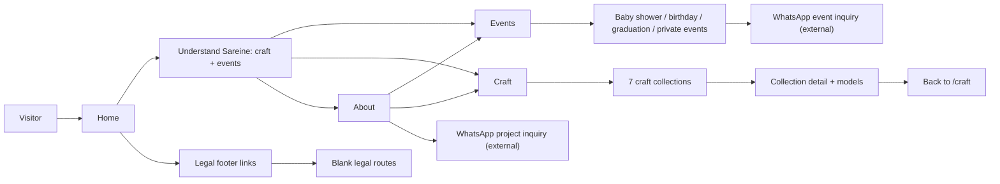

## Screenshots

Screenshots were generated with Playwright against the existing local Next server on `http://localhost:3000` and saved under `docs/audit-assets/`.

| Page | Desktop | Mobile |
|---|---|---|
| Home | 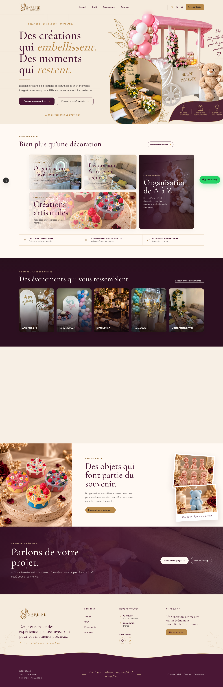 | 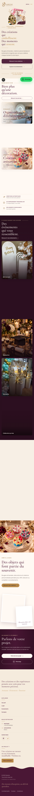 |
| Events | 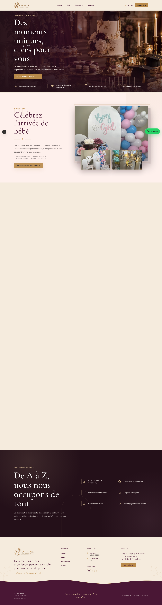 | 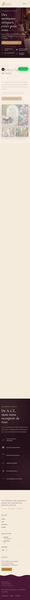 |
| Craft | 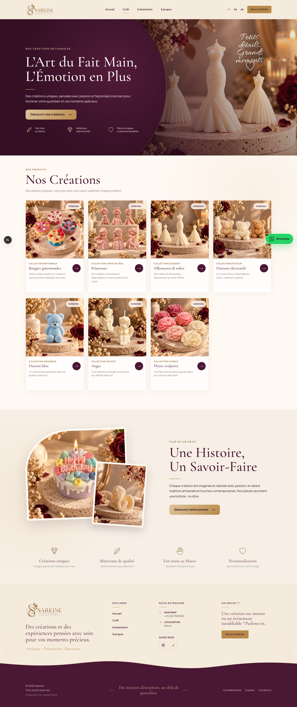 | 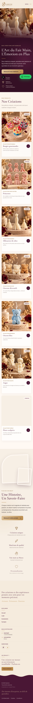 |
| About | 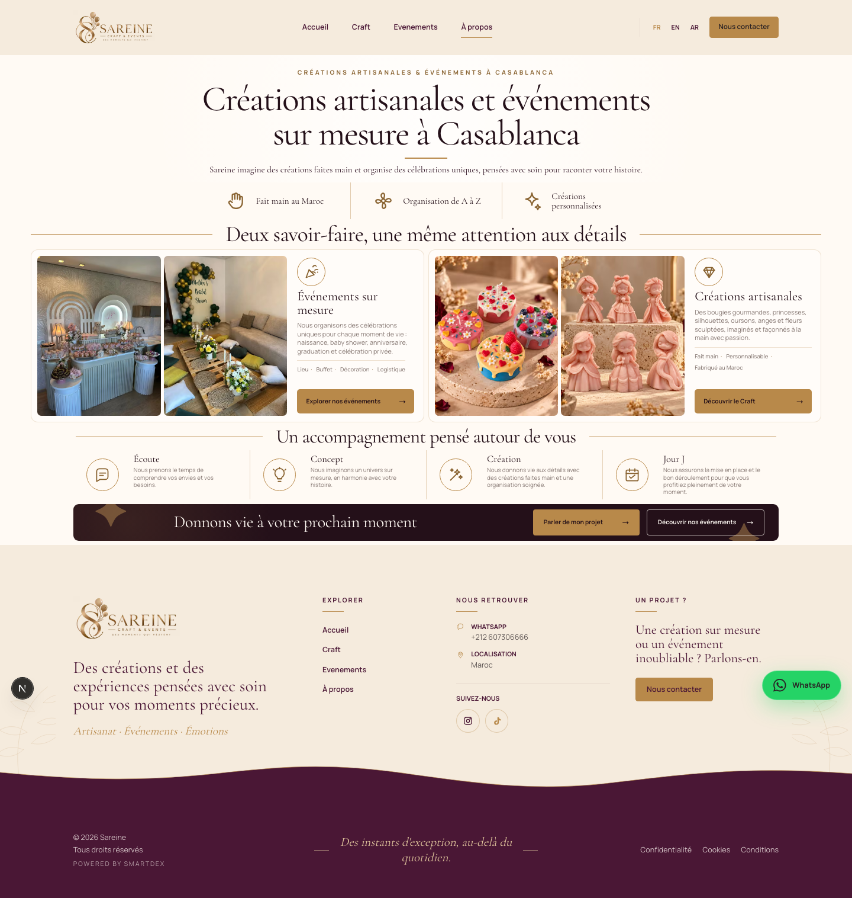 | 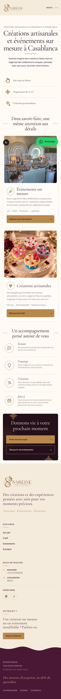 |
| Craft detail example | 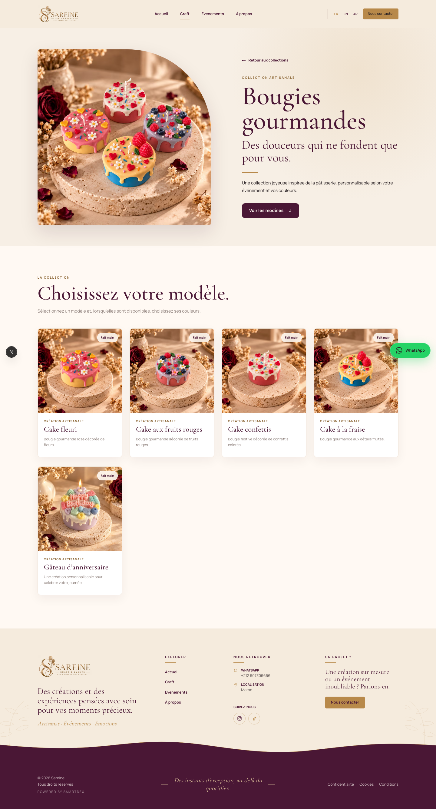 | Not captured |

Screenshot note: full-page screenshots can show scroll-animated content before it has entered the viewport. This is especially visible in long mobile pages where sections using `.scroll-rise` may appear faded or blank in offscreen portions of the capture, even though they animate during user scroll.

## Page-by-Page Visual Audit

## Page — Home

### Route
`/`

### Source
`src/app/(public)/page.tsx`

### Purpose
Introduce Sareine as a craft and events brand, split visitors into craft, events, and WhatsApp conversion paths.

### Current Structure

```text
┌──────────────────────────────────────────────┐
│ Header                                       │
├──────────────────────────────────────────────┤
│ Hero: brand promise + craft/events CTAs      │
├──────────────────────────────────────────────┤
│ Services: events / decoration / craft / A-Z  │
├──────────────────────────────────────────────┤
│ Event categories cards                       │
├──────────────────────────────────────────────┤
│ A-Z process timeline                         │
├──────────────────────────────────────────────┤
│ Craft highlight editorial section            │
├──────────────────────────────────────────────┤
│ Project contact / WhatsApp section           │
├──────────────────────────────────────────────┤
│ Footer + floating WhatsApp                   │
└──────────────────────────────────────────────┘
```

### Visual Hierarchy
Strong hero with clear brand proposition and two primary discovery paths. The later event categories section is visually rich, but on mobile the long image stack creates a heavy section before the process section.

### Navigation
Clear header/footer navigation. Homepage service cards contain `href` data but are rendered as non-clickable `article` cards, creating a mismatch between data intent and UI.

### UX
The page answers who Sareine is, what it offers, and how to contact via WhatsApp. "A à Z" is explained in both the services and process sections.

### Responsive Behaviour
Mobile screenshots show the page remains readable, with strong vertical rhythm. The event card section is very tall on mobile and may delay access to later content.

### Accessibility
The hero uses a real `h1`; images have alt text. Decorative images are hidden in some places. CTA buttons/links are keyboard focusable.

### SEO
Inherits root metadata from `src/app/layout.tsx`; no page-specific homepage metadata beyond root title/description.

### Performance
Uses multiple high-resolution visual assets and a `priority` hero image. Reasonable for visual brand, but image budget should be monitored.

### Technical Observations
All homepage content is sourced from `src/data/home.ts`, which is good for maintainability.

### Issues
- `UX-001`: Service cards look like navigational cards but do not link.
- `UX-002`: Two CTAs in the final project section point to the same WhatsApp destination.
- `RESP-001`: Event category section is visually long on mobile.

### Recommendations
- Make service cards clickable or remove unused `href` values from the data.
- Deep-link homepage event category cards to corresponding event anchors.
- Keep one primary WhatsApp CTA and one alternate discovery CTA in the final project section.

## Page — Events

### Route
`/events`

### Source
`src/app/(public)/events/page.tsx`

### Purpose
Present Sareine's event services and drive visitors to WhatsApp inquiries.

### Current Structure

```text
┌──────────────────────────────────────────────┐
│ Header                                       │
├──────────────────────────────────────────────┤
│ Dark event hero + CTA to #baby-shower        │
├──────────────────────────────────────────────┤
│ Baby shower chapter                          │
├──────────────────────────────────────────────┤
│ Anniversaire chapter                         │
├──────────────────────────────────────────────┤
│ Remise de diplômes chapter                   │
├──────────────────────────────────────────────┤
│ Événements privés chapter                    │
├──────────────────────────────────────────────┤
│ Service process: A-Z service list            │
├──────────────────────────────────────────────┤
│ Footer + floating WhatsApp                   │
└──────────────────────────────────────────────┘
```

### Visual Hierarchy
Strong editorial structure and premium event imagery. Each category has image stacks and a WhatsApp CTA.

### Navigation
Hero scrolls to `#baby-shower`. Category sections have stable IDs. A sticky `EventNavigation` component exists but is not used in `EventsExperience`, so the page lacks an in-page category index.

### UX
Clear service categories and WhatsApp conversion. No event detail cards/pages are surfaced despite `/events/[slug]` existing.

### Responsive Behaviour
Mobile screenshot shows readable hero and first event section. Full-page screenshot reveals very large blank/faded offscreen areas caused by scroll animation capture behavior; verify scroll animations manually across devices.

### Accessibility
Images are buttons with `aria-label`s and alt text. Lightbox returns focus to the opener, but there is no full focus trap inside the dialog.

### SEO
Page-level metadata exists in `src/app/(public)/events/page.tsx`.

### Performance
`EventsExperience` is a client component for the whole events page because of lightbox state. This ships more JS than a server-rendered static chapter page with a client lightbox island would.

### Technical Observations
Several alternative event chapter components exist but are unused: `CinematicChapter`, `EditorialGridChapter`, `FeatureGalleryChapter`, `GraduationChapter`, `OverlapChapter`, `EventsSignature`, `EventsFinalCta`, and `EventNavigation`.

### Issues
- `NAV-002`: `EventNavigation` exists but is not rendered.
- `ARCH-002`: `/events/[slug]` route exists and renders `null`.
- `PERF-002`: Entire events experience is client-rendered for lightbox state.
- `UX-003`: Event category CTAs all go directly to WhatsApp; there is no secondary detail route.

### Recommendations
- Either use `EventNavigation` or remove it from the intended current architecture.
- Decide whether event details are section anchors only or real detail pages; then remove or implement `/events/[slug]`.
- Split static event content into server components and keep only lightbox/gallery controls client-side if performance becomes an issue.

## Page — Craft

### Route
`/craft`

### Source
`src/app/(public)/craft/page.tsx`

### Purpose
Introduce Sareine handmade craft work and route visitors to craft collection detail pages.

### Current Structure

```text
┌──────────────────────────────────────────────┐
│ Header                                       │
├──────────────────────────────────────────────┤
│ Craft hero + values + #creations CTA         │
├──────────────────────────────────────────────┤
│ Collections grid                             │
│ - Bougies gourmandes                         │
│ - Princesses                                 │
│ - Silhouettes & robes                        │
│ - Oursons décoratifs                         │
│ - Ourson bleu                                │
│ - Anges                                      │
│ - Fleurs sculptées                           │
├──────────────────────────────────────────────┤
│ Story / savoir-faire section                 │
├──────────────────────────────────────────────┤
│ Footer + floating WhatsApp                   │
└──────────────────────────────────────────────┘
```

### Visual Hierarchy
The strongest content architecture on the site. The collection card grid maps cleanly to real detail pages.

### Navigation
Good `/craft/{slug}` navigation. Hero CTA anchors to `#creations`. Story CTA goes to `/about`.

### UX
Visitors can inspect collections and models. There is no direct craft inquiry CTA on collection cards/detail pages, so conversion depends on global WhatsApp/header/footer.

### Responsive Behaviour
Mobile screenshot is long but coherent. The craft section uses stable image/card sizing.

### Accessibility
Collection cards include descriptive `aria-label`s and image alt text.

### SEO
Page-level metadata exists. Collection detail pages generate metadata from collection data.

### Performance
Many PNG product images are large. Next Image helps, but source files should still be optimized.

### Technical Observations
`src/data/craft-page.ts` contains a separate `creations.items` gallery-like array, but `CraftCreationsSection` only renders `craftCollections`. The current page ignores the individual creation items.

### Issues
- `DATA-002`: `craftPageData.creations.items` is defined but not rendered by the craft page.
- `CONV-001`: Craft detail pages lack a local inquiry CTA.

### Recommendations
- Decide whether `/craft` is a collection index or an individual creation gallery; remove or use the unused data accordingly.
- Add a collection-level WhatsApp CTA in a later implementation phase if craft conversion is important.

## Page — Craft Collection Detail

### Route
`/craft/[slug]`

### Source
`src/app/(public)/craft/[slug]/page.tsx`

### Purpose
Show one craft collection, its cover, description, model list, and color variants where applicable.

### Current Structure

```text
┌──────────────────────────────────────────────┐
│ Header                                       │
├──────────────────────────────────────────────┤
│ Collection hero: cover + back link + CTA     │
├──────────────────────────────────────────────┤
│ #modeles grid                                │
│ - Model cards                                │
│ - Optional color swatches                    │
├──────────────────────────────────────────────┤
│ Footer + floating WhatsApp                   │
└──────────────────────────────────────────────┘
```

### Visual Hierarchy
Clear hero/detail split and useful model cards. Color swatches are interactive.

### Navigation
Back link to `/craft` and anchor to `#modeles`. Generated paths are limited by `dynamicParams = false`.

### UX
Good browsing flow, but no collection-specific quote/order CTA.

### Responsive Behaviour
Desktop screenshot for `bougies-gourmandes` captured successfully.

### Accessibility
Swatch buttons include `aria-label` and `aria-pressed`.

### SEO
Collection metadata comes from `collection.name` and `collection.shortDescription`.

### Issues
- `CONV-002`: No detail-page conversion CTA beyond global WhatsApp.

### Recommendations
- Add a collection-aware WhatsApp inquiry later with prefilled collection name.

## Page — About

### Route
`/about`

### Source
`src/app/(public)/about/page.tsx`, `src/components/about/AboutExperience/AboutExperience.tsx`, `src/data/about.ts`

### Purpose
Explain brand positioning, two service pillars, process, and trust signals.

### Current Structure

```text
┌──────────────────────────────────────────────┐
│ Header                                       │
├──────────────────────────────────────────────┤
│ Hero: craft + events in Casablanca           │
├──────────────────────────────────────────────┤
│ Trust items                                  │
├──────────────────────────────────────────────┤
│ Pillar cards: events / craft                 │
├──────────────────────────────────────────────┤
│ Process steps                                │
├──────────────────────────────────────────────┤
│ Final CTA: WhatsApp + Events                 │
├──────────────────────────────────────────────┤
│ Footer + floating WhatsApp                   │
└──────────────────────────────────────────────┘
```

### Visual Hierarchy
Compact and effective. The page is much shorter than home/events/craft and acts as a useful brand bridge.

### Navigation
Pillar CTAs route to `/events` and `/craft`; final CTA routes to WhatsApp and `/events`.

### UX
Clear explanation of two business lines and process.

### Responsive Behaviour
Mobile screenshot is readable and compact.

### Accessibility
Uses headings, semantic sections, list items, and descriptive image alt text.

### SEO
Strongest page metadata in the app: canonical, keywords, OpenGraph, and Twitter metadata.

### Issues
- `SEO-002`: About page has rich metadata while other important pages have thinner metadata, creating inconsistency.

### Recommendations
- Use the about page metadata structure as a model for home/events/craft/legal pages.

## Page — Contact

### Route
`/contact`

### Source
`src/app/(public)/contact/page.tsx`

### Purpose
Intended contact page.

### Current Structure
Returns `null`.

### Issues
- `HIGH`: Real public route with blank content.

### Recommendations
- Implement minimal contact content, redirect to WhatsApp, or remove the route before launch.

## Page — Legal Routes

### Routes
`/privacy`, `/terms`, `/cookies`

### Source
`src/app/(public)/privacy/page.tsx`, `src/app/(public)/terms/page.tsx`, `src/app/(public)/cookies/page.tsx`

### Purpose
Footer legal pages.

### Current Structure
All return `null`.

### Issues
- `HIGH`: Footer points users to blank legal pages.

### Recommendations
- Add legal copy, mark as noindex until content is finalized, or temporarily remove footer links.

## Page — Auth/Admin Routes

### Routes
`/login`, `/forgot-password`, `/reset-password`, `/admin`, `/admin/events`, `/admin/inquiries`, `/admin/media`, `/admin/products`, `/admin/projects`, `/admin/settings`

### Source
`src/app/(auth)/**/page.tsx`, `src/app/(admin)/admin/**/page.tsx`

### Current Structure
All return `null`. Admin layout also returns children without auth guard.

### Issues
- `MEDIUM`: Empty admin/auth routes are routable in production.

### Recommendations
- If they are future work, remove from production branch or protect with middleware/notFound until implemented.

## Homepage Deep Audit

Section order and intent:

| Order | Section | Component | Data Source | Images | CTA | Destination | Conversion Purpose |
|---:|---|---|---|---|---|---|---|
| 1 | Navbar | `PublicHeader` | `navigation.ts`, `site.ts`, `social.ts` | Logo | Project CTA | WhatsApp | Global conversion |
| 2 | Hero | `Hero` | `homeHero` | `right side.png`, older hero images are commented | Discover creations / events | `/craft`, `/events` | Segment visitors |
| 3 | Services | `ServicesSection` | `homeServices` | Events/craft images | Discover services | `/events` | Explain offer |
| 4 | Event categories | `EventCategoriesSection` | `homeEventCategories` | 5 event images | Discover events | `/events` | Event exploration |
| 5 | A-Z process | `ProcessSection` | `homeProcess` | None | Confier mon événement | WhatsApp | Event lead |
| 6 | Craft highlight | `CraftHighlightSection` | `homeCraftHighlight` | 3 craft images | Discover creations | `/craft` | Craft exploration |
| 7 | Project contact | `ProjectContactSection` | `homeProjectContact` | Private event background | Project / WhatsApp | WhatsApp | Final conversion |
| 8 | Footer | `PublicFooter` | site/nav/legal/social | Logo | Project CTA | WhatsApp | Persistent conversion |

Homepage question coverage:

| Question | Answered? | Evidence |
|---|---|---|
| Who is Sareine? | Mostly | Hero and about/footer positioning explain craft + events, but company details are sparse. |
| What does Sareine offer? | Yes | Hero, services, events, craft highlight. |
| Why choose Sareine? | Yes | A-Z process, handmade values, premium imagery. |
| What types of events are offered? | Yes | Event categories section. |
| What types of crafts are offered? | Partly | Craft highlight teases crafts; full categories require `/craft`. |
| What does "A à Z" mean? | Yes | Process section lists idea, concept, venue, decoration, buffet/logistics, day-of. |
| How does a visitor contact Sareine? | Yes | WhatsApp is persistent and repeated. |
| What should visitor do next? | Yes | Craft/events/WhatsApp CTAs are clear. |

Homepage current-state risks:

- Visual density is high but brand-appropriate.
- Service card `href` values are not used by the rendered cards.
- Multiple WhatsApp CTAs are clear, but repeated labels/destinations may feel redundant.
- Home event cards could be more useful with category anchors.

## Events Page Deep Audit

Event categories currently represented:

| Event type | Section ID | Images | Copy | CTA | CTA destination |
|---|---|---|---|---|---|
| Baby shower | `baby-shower` | `baby-shower-01.webp`, `baby-shower-02.webp`, `birth-01.webp` | Soft/fairy baby arrival celebration | Découvrir les Baby Showers | WhatsApp event inquiry |
| Anniversaire | `anniversaire` | `birthday-01.webp`, `birthday-02.webp`, `birthday-03.webp` | Creative themes and complete organization | Découvrir les anniversaires | WhatsApp event inquiry |
| Remise de diplômes | `remise-de-diplomes` | `graduation-mock-01.webp`, `graduation-mock-02.webp` | Achievement celebration | Découvrir les remises de diplômes | WhatsApp event inquiry |
| Événements privés | `evenements-prives` | `private-event-02.webp`, `private-event-01.webp` | Private receptions and dinners | Découvrir les événements privés | WhatsApp event inquiry |

Observations:

- Categories are visually distinguishable by image sets, but most sections share the same `EventChapter` layout rather than using the specialized chapter components present in the repository.
- Graduation images are explicitly marked `temporary: true` in `src/data/events.ts`.
- `EventsFinalCta` data and component exist but are not rendered by `EventsExperience`.
- `eventsServiceSection.primaryCta` exists in data but `ServiceProcess` does not display a CTA.
- No `/events/{slug}` detail URLs are generated from event category data.

## Crafts Page Deep Audit

Craft data storage:

- Landing page content: `src/data/craft-page.ts`
- Collection/detail content: `src/data/craft-collections.ts`
- Type contracts: `src/types/craft.ts`
- Legacy/general craft product records: `src/data/craft.ts` with `crafts: []`

Craft category map:

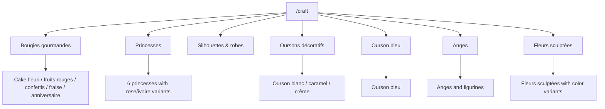

Architecture readiness:

| Area | Current State | API Readiness |
|---|---|---|
| Slugs | Stable collection slugs in data | API READY |
| Item IDs | Stable item IDs in data | API READY |
| Images | Hardcoded public paths | MINOR REFACTOR REQUIRED |
| Color variants | Structured color arrays | API READY |
| Product pricing/availability | Not present in collection data | SIGNIFICANT REFACTOR REQUIRED for commerce |
| Craft records | `crafts` array empty | SIGNIFICANT REFACTOR REQUIRED if replacing collections with products |

## Global Component Audit

| Component | Used On | Reusable? | Consistent? | Issue | Recommendation |
|---|---|---:|---:|---|---|
| `PublicHeader` | All public pages | Yes | Mostly | Complex scroll tone detection; language selector state only local and non-routing | Keep but document behavior; implement real locale routing or remove inactive language UI later. |
| `PublicFooter` | All public pages | Yes | Yes | Legal links point to blank pages | Fill legal pages or hide links. |
| `FloatingWhatsApp` | All public pages | Yes | Yes | Can overlap content on small screens | Verify bottom spacing on all long pages. |
| `ProjectCTA` | Header | Yes | Partly | Label default says "Contacter nous" | Correct copy in a future content pass. |
| `Button` | Shared UI | Yes | Yes | Uses text arrow `->` rather than icon | Acceptable, but align with design system if icons are introduced. |
| `Container` | Shared UI | Yes | Yes | Clear width tokens | Keep. |
| `Section` | Some home sections | Yes | Partly | Many pages bypass it with custom classes | Standardize slowly if refactoring. |
| `SectionHeader` | Limited usage | Yes | Partly | Not broadly adopted | Either adopt or keep minimal. |
| `EventsLightbox` | Events page | Yes | Mostly | Dialog lacks full focus trap | Improve keyboard handling. |
| `EventChapter` | Events categories | Yes | Yes | Several alternate event chapter components unused | Remove or document as experiments. |
| `CraftCreationsSection` | `/craft` | Yes | Yes | Renders collections, not `craftPageData.creations.items` | Align data shape with UI. |
| `CraftCollectionPage` | `/craft/[slug]` | Yes | Yes | No local inquiry CTA | Add later for conversion. |

## Design System Audit

### Colors

Defined in `src/app/globals.css`:

| Token | Value |
|---|---|
| Gold 100 | `#f5ebdd` |
| Gold 300 | `#dfc49c` |
| Gold 500 / Primary | `#b8894a` |
| Gold 700 | `#896331` |
| Plum 100 | `#f1e6ec` |
| Plum 300 | `#a87b92` |
| Plum 500 / Secondary | `#4a1735` |
| Plum 700 | `#351025` |
| Plum 800 | `#2c0f20` |
| Plum 900 | `#241019` |
| Ivory | `#fff9f3` |
| Cream | `#f7efe5` |
| Sand / Border | `#e9ddd0` |
| Taupe / Muted | `#8a7c77` |
| Charcoal / Foreground | `#292124` |

Inconsistencies:

- Several components use hardcoded one-off colors such as `#fbf4ec`, `#fff1ed`, and WhatsApp greens.
- Color system is strong but arbitrary Tailwind colors bypass tokens in events components.

### Typography

| Role | Implementation |
|---|---|
| Display | `Cormorant_Garamond` via `next/font/google`, `--font-display` |
| Body | `Manrope`, `--font-sans` |
| Script | `Allura`, `--font-script`, loaded globally but limited visible use |
| Sizing | Global utilities `.type-display-xl`, `.type-h1`, `.type-h2`, `.type-h3`, `.type-body-lg`, etc. |
| Strategy | Responsive `clamp()` font sizes for display/headings; body is fixed/rem-based. |

### Spacing

| Token | Value |
|---|---|
| `--container-max` | `90rem` |
| `--container-readable` | `45rem` |
| `--section-space` | `clamp(4.5rem, 8.1vw, 10rem)` |
| `--page-padding` | `clamp(1.25rem, 3.6vw, 4rem)` |

### Radius

Patterns include `rounded-[4px]`, `rounded-[6px]`, `rounded-xl`, `rounded-full`, and custom CSS Module radii. Most UI uses small radii, while CTA pills and WhatsApp button use large/full radius.

### Shadows

Shadows are mostly custom arbitrary values, especially image/card shadows in event sections. They support the premium editorial feeling but are not tokenized.

### Buttons

| Variant | Source | Notes |
|---|---|---|
| `primary` | `Button.tsx` | Gold background, plum text. |
| `secondary` | `Button.tsx` | Ivory background, plum text. |
| `text` | `Button.tsx` | Transparent underline style. |
| Custom hero CTAs | Home/Craft/Events modules | Several custom CTA implementations outside shared button. |
| WhatsApp CTA | `FloatingWhatsApp`, footer, project sections | Green external conversion style. |

### Containers

Consistent shared `Container` exists, but some sections use custom `mx-auto max-w` classes directly.

## Brand Consistency

Strengths:

- Gold, plum, ivory, and warm neutrals are consistently present.
- Logo usage is centralized in `siteData.brand`.
- Imagery strongly supports events and handmade craft.
- The About page and homepage copy align with premium artisanal positioning.

Risks:

- Events components use several unique color surfaces that are close to, but not always exactly, global tokens.
- Some iconography is hand-coded SVG or text symbols; this is visually charming but not consistently systematized.
- `Evenements` in navigation lacks accent while page copy uses French accents elsewhere.

## Responsive Audit

| Component/Page | Mobile 375px | Tablet 768px | Desktop 1024px | Large 1440/1920px | Issue |
|---|---|---|---|---|---|
| Header | GOOD | CHECK | GOOD | GOOD | Mobile menu behavior is complex; verify focus order manually. |
| Home hero | GOOD | GOOD | GOOD | GOOD | Hero image and text are readable. |
| Home events section | CHECK | CHECK | GOOD | GOOD | Mobile section is very tall. |
| Home final CTA | GOOD | CHECK | GOOD | GOOD | Floating WhatsApp can sit near bottom actions. |
| Events hero | GOOD | GOOD | GOOD | GOOD | Strong visual presentation. |
| Events chapters | CHECK | CHECK | GOOD | GOOD | Scroll animations should be tested by manual scrolling, not full-page screenshots only. |
| Event lightbox | CHECK | CHECK | GOOD | GOOD | Focus trap and mobile swipe need manual QA. |
| Craft landing | GOOD | GOOD | GOOD | GOOD | Stable cards and readable flow. |
| Craft detail | CHECK | GOOD | GOOD | GOOD | Only desktop screenshot captured for detail page; mobile should be verified before launch. |
| About | GOOD | GOOD | GOOD | GOOD | Compact and readable. |
| Footer | GOOD | GOOD | GOOD | GOOD | Legal links are blank destinations. |

## Image / Asset Audit

Asset summary:

| Asset Area | Count/Type | Observation |
|---|---|---|
| Logos | 2 PNG files | `sareine-logo.png` and horizontal logo are large source PNGs. |
| Home images | PNG hero/event imagery | Some files exceed 2 MB. |
| Event images | WebP images | Good format choice; several are 1920x2560. |
| Craft creation images | JPG 1600x1600 | Good consistent dimensions; many are unused by current UI/data. |
| Craft collection images | PNG 640/1254 square files | Several >2 MB; candidates for WebP conversion. |

Largest assets found:

| Asset | Size | Dimensions | Issue | Recommendation |
|---|---:|---|---|---|
| `public/images/home/hero/bridal-shower-green.png` | ~3.2 MB | 1200x1600 | Large PNG | Convert to WebP/AVIF source. |
| `public/images/craft/collections/Cakes/Cakes_02.png` | ~2.2 MB | 1254x1254 | Large PNG | Convert/optimize. |
| `public/images/home/hero/right side.png` | ~2.1 MB | 1327x1186 | Filename contains space; large PNG | Rename later and optimize. |
| `public/images/home/events/graduation.png` | ~2.1 MB | 1122x1402 | Large PNG | Convert/optimize. |
| `public/brand/sareine-logo-horizontal.png` | Large source dimensions | 1942x809 | Logo displayed around 200px in footer | Provide smaller optimized display asset. |

## Data Architecture Audit

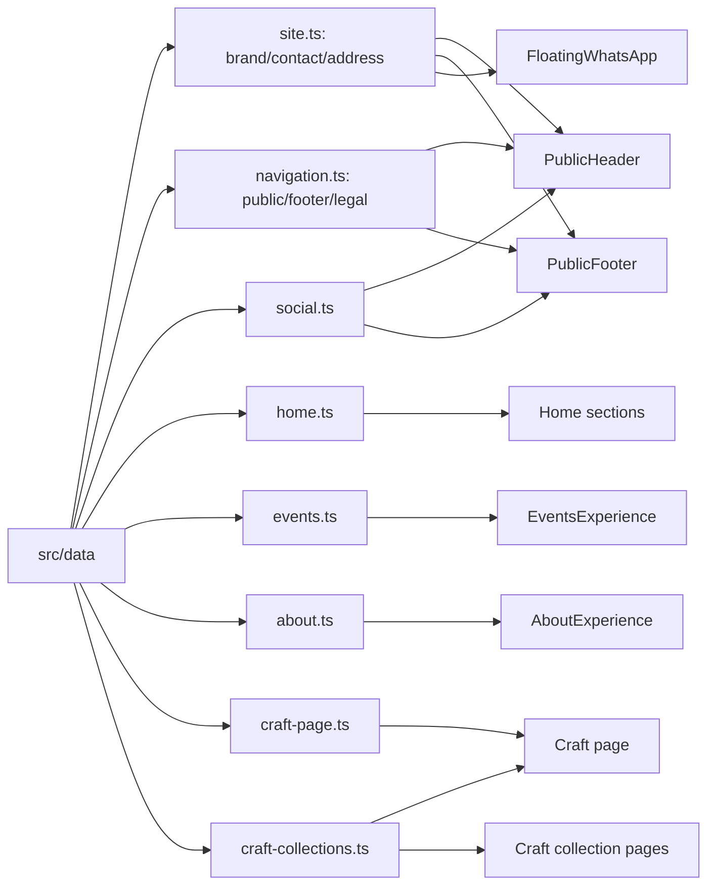

Centralized content:

- Address, WhatsApp, logo, social links: `site.ts` / `social.ts`
- Header/footer/legal nav: `navigation.ts`
- Homepage: `home.ts`
- Events: `events.ts`
- Craft landing: `craft-page.ts`
- Craft collections: `craft-collections.ts`
- About: `about.ts`

Duplicated/hardcoded content:

- WhatsApp project message appears in multiple data/components.
- Event category labels appear in event data and homepage event cards separately.
- Several image/color style values are hardcoded in components instead of tokens.

## API-Readiness Audit

| Area | Classification | Why |
|---|---|---|
| `siteData` | API READY | Single object with typed contact/brand/address. |
| Navigation | API READY | Simple arrays of label/href. |
| Homepage data | MINOR REFACTOR REQUIRED | Mostly typed, but WhatsApp href is computed at import time. |
| Events data | MINOR REFACTOR REQUIRED | Typed categories and images; no event detail records; `events: []` unused. |
| Craft collections | API READY | Slugs, item IDs, image data, colors, and metadata are structured. |
| Craft products | SIGNIFICANT REFACTOR REQUIRED | `crafts: []`; page uses collections rather than product records. |
| Auth/admin | SIGNIFICANT REFACTOR REQUIRED | Routes exist but have no UI, auth, API calls, or guards. |
| Images | MINOR REFACTOR REQUIRED | Public path strings work, but CMS/API images need loader/storage strategy. |

## Accessibility Audit

Concrete strengths:

- Root `html` has `lang="fr"`.
- Global `:focus-visible` outline exists.
- Many images have meaningful alt text.
- Craft color swatches use `aria-label` and `aria-pressed`.
- Event image buttons include descriptive `aria-label`.
- Mobile menu handles Escape and body scroll lock.

Concrete risks:

| Area | Source | Risk | Recommendation |
|---|---|---|---|
| Empty routes | `contact`, legal, auth/admin, event detail pages | Blank pages provide no heading, landmark content, or user explanation | Implement content or return `notFound()`. |
| Lightbox | `EventsLightbox` | Dialog has close/next/previous, but no full focus trap | Add focus trap and ensure Tab cycles within modal. |
| Hidden scrollbars | `EventNavigation` | Scrollable category nav hides scrollbars | If used, provide visible overflow affordance. |
| Visual-only icons | Several SVG/text icons | Mostly decorative; some text symbols may be read oddly if not hidden | Ensure all decorative icons use `aria-hidden`. |
| Contrast | Custom overlays | Some text over images uses overlays; needs measured contrast | Run contrast checks on hero/event overlays. |
| Buttons vs links | Services cards | Cards look interactive but are not links | Make affordance match behavior. |

## SEO Audit

| SEO Item | Status | Source | Recommendation |
|---|---|---|---|
| Root title/description | GOOD | `src/app/layout.tsx` | Add `metadataBase`, OpenGraph, Twitter, canonical defaults. |
| Locale | GOOD | `html lang="fr"` | Keep. |
| Home metadata | CHECK | Inherits root metadata | Add page-specific home OpenGraph/canonical. |
| Events metadata | GOOD | `src/app/(public)/events/page.tsx` | Add OpenGraph image/canonical. |
| Craft metadata | GOOD | `src/app/(public)/craft/page.tsx` | Add OpenGraph image/canonical. |
| Craft collection metadata | GOOD | `generateMetadata` from collection | Add canonical and OG image from cover. |
| About metadata | GOOD | Rich metadata in `about/page.tsx` | Use as pattern for others. |
| Legal metadata | ISSUE | Blank pages, no metadata | Add noindex until content exists. |
| Admin/auth metadata | ISSUE | Blank routes, no robots/noindex | Protect or noindex. |
| Sitemap | MISSING | No `sitemap.ts` found | Add sitemap for active routes only. |
| Robots | MISSING | No `robots.ts` found | Add rules, especially for admin/auth. |
| Manifest | MISSING | No manifest found | Optional, add if PWA/social brand requires. |
| Structured data | MISSING | No JSON-LD found | Add Organization/LocalBusiness later. |

Semantic structure:

- Home, events, craft, and about have meaningful headings.
- Public layout wraps pages in `<main>`.
- Empty routes are the biggest semantic/SEO issue.

## Performance Audit

Measured verification:

- `npm run build`: passed.
- `npm run lint`: passed.
- Build route output: 28 generated/static/dynamic routes.
- No Lighthouse run was performed; findings below are static/code/screenshot observations.

Performance risks:

| Risk | Evidence | Severity | Recommendation |
|---|---|---:|---|
| Large PNG/JPG source files | Several 2 MB+ PNGs and 1600x1600 JPGs | MEDIUM | Convert large PNGs to WebP/AVIF source where practical. |
| Entire events page client component | `EventsExperience` starts with `"use client"` | MEDIUM | Move static chapters to server components; isolate lightbox. |
| Many images with high visual priority | Home/craft/events rely on large imagery | MEDIUM | Audit priority usage and image `sizes` after final layout. |
| Scroll animations | Global `.scroll-rise` view-timeline animations | LOW/MEDIUM | Test browsers that lack `animation-timeline`. |
| Logo display size | Large logo file shown at small sizes | LOW | Add optimized logo variants. |

## Dependency Audit

| Dependency | Role | Usage | Recommendation |
|---|---|---|---|
| `next` | Framework | Core app | Keep. |
| `react`, `react-dom` | UI | Core app | Keep. |
| `tailwindcss`, `@tailwindcss/postcss` | Styling | Used by `globals.css` and PostCSS | Keep. |
| `typescript` | Type checking | Used | Keep. |
| `eslint`, `eslint-config-next` | Lint | Used by `npm run lint` | Keep. |
| `sharp` | Image processing | Used in `scripts/optimize-event-images.mjs` | Keep if script remains. |
| `heic-convert` | HEIC conversion | Used in image optimization script | Keep if HEIC workflow remains. |
| `babel-plugin-react-compiler` | React compiler support | Present with `reactCompiler: true` | Keep but verify Next/React compiler compatibility during upgrades. |

No dependency removal is recommended from this audit.

## Dead Code / UNUSED Page Audit

| Area | Evidence | Status | Recommendation |
|---|---|---|---|
| Empty public pages | `/contact`, `/privacy`, `/terms`, `/cookies` return `null` | Unfinished | Implement, redirect, noindex, or remove. |
| Empty event detail | `/events/[slug]` returns `null` | Unfinished | Implement or remove route. |
| Empty auth/admin | All auth/admin page files return `null` | Unfinished | Protect or remove from production routing. |
| Unused event components | `CinematicChapter`, `EditorialGridChapter`, `FeatureGalleryChapter`, `GraduationChapter`, `OverlapChapter`, `EventsSignature`, `EventsFinalCta`, `EventNavigation` not imported by active page | Likely abandoned/experimental | Document intent, use, or remove later. |
| Empty records | `events: []`, `crafts: []`, `testimonials: []` | Future placeholders | Keep only if roadmap needs them. |
| `src/features/.DS_Store` | OS metadata file | Noise | Remove later. |
| Commented hero image block | `Hero.tsx` contains large commented image implementation | Dead/commented code | Remove during cleanup if not needed. |

## User Journey Analysis

### Journey A — Discover Sareine

```text
Landing
→ Hero: craft + events value proposition
→ Services
→ Events/Craft sections
→ About or WhatsApp
```

Friction:

- Strong initial communication.
- Some later sections are image-heavy before conversion.
- About is useful but not emphasized as a trust-building step until nav/footer.

### Journey B — Find an event service

```text
Landing
→ Events
→ Category section
→ WhatsApp inquiry
```

Friction:

- Homepage category cards do not deep-link to category anchors.
- `/events/[slug]` exists but does not support detail exploration.
- Sticky event index exists but is not rendered.

### Journey C — Discover crafts

```text
Landing
→ Craft
→ Collection
→ Models / color options
→ Global WhatsApp
```

Friction:

- Strong browse flow.
- Conversion is global, not collection-specific.
- Individual creation data in `craft-page.ts` is not visible on the current craft page.

## Conversion Audit

| CTA | Location | Destination | Clear? | Consistent? | Issue |
|---|---|---|---:|---:|---|
| Découvrir nos créations | Home hero | `/craft` | Yes | Yes | None. |
| Explorer nos événements | Home hero | `/events` | Yes | Yes | None. |
| Découvrir nos services | Home services | `/events` | Mostly | Mostly | Services includes craft too, destination is only events. |
| Confier mon événement | Home process | WhatsApp | Yes | Yes | Good event conversion. |
| Découvrir les créations | Home craft highlight | `/craft` | Yes | Yes | None. |
| Parler de mon projet | Home final / Header / Footer / About | WhatsApp | Yes | Yes | Repeated frequently. |
| WhatsApp | Home final / Floating button / Footer | WhatsApp | Yes | Yes | Duplicate with project CTA in same final section. |
| Découvrir nos événements | Events hero | `#baby-shower` | Mostly | No | Label implies all events but jumps to first category. |
| Event category CTAs | Events chapters | WhatsApp | Yes | Yes | Could include category in WhatsApp text later. |
| Découvrir nos créations | Craft hero | `#creations` | Yes | Yes | None. |
| Collection cards | Craft grid | `/craft/{slug}` | Yes | Yes | Good. |
| Voir les modèles | Craft detail | `#modeles` | Yes | Yes | None. |
| Découvrir notre univers | Craft story | `/about` | Yes | Yes | Good trust path. |
| Footer legal links | Footer | Blank legal pages | No | No | High-priority content gap. |

## Full Website Relationship Diagram

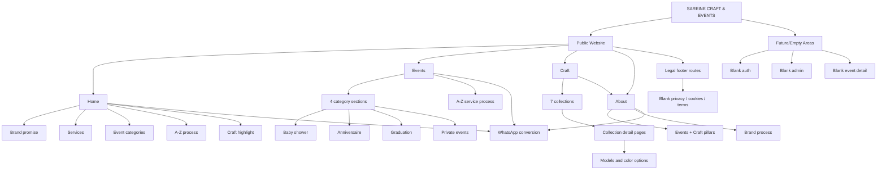

# Issue Register

| ID | Severity | Area | Page/Component | Issue | Evidence | Recommended Action |
|---|---|---|---|---|---|---|
| ARCH-001 | HIGH | Routing | Legal/contact pages | Public and footer-linked pages return blank content | `contact`, `privacy`, `terms`, `cookies` page files return `null` | Implement content, redirect, noindex, or remove links. |
| ARCH-002 | MEDIUM | Routing | `/events/[slug]` | Dynamic event detail route returns blank content | `src/app/(public)/events/[slug]/page.tsx` returns `null` | Implement detail pages or remove route. |
| ARCH-003 | MEDIUM | Routing/Security | Admin/auth pages | Admin/auth routes are routable but blank and unguarded | `src/app/(admin)` and `src/app/(auth)` pages return `null` | Add middleware/guards or remove from production. |
| NAV-001 | HIGH | Navigation | Footer legal nav | Legal links are active but lead to blank pages | `legalNavigation` links to `/privacy`, `/cookies`, `/terms` | Fill legal routes before launch. |
| NAV-002 | LOW | Events | `EventNavigation` | Sticky event nav exists but is unused | No imports found for `EventNavigation` | Use it or remove/document it. |
| UX-001 | MEDIUM | Homepage | `ServicesSection` | Cards look like navigational tiles but are not links | `homeServices.cards` include `href`; rendered as `article` | Make cards clickable or remove href data. |
| UX-002 | LOW | Homepage | `ProjectContactSection` | Two adjacent CTAs lead to same WhatsApp URL | `primaryCta` and `whatsappCta` both use project WhatsApp | Differentiate actions or remove duplicate. |
| UX-003 | MEDIUM | Events | Category navigation | Homepage event category cards all go to `/events` instead of anchors | `homeEventCategories.categories[*].href` are `/events` | Deep-link to event IDs. |
| RESP-001 | MEDIUM | Mobile | Home/events long sections | Mobile event sections are very tall and scroll-heavy | Screenshots show long vertical image sections | Review mobile section heights and density. |
| A11Y-001 | MEDIUM | Modal | Events lightbox | Dialog lacks full focus trap | `EventsLightbox` handles close/focus restore but not Tab trap | Add focus trap and keyboard QA. |
| A11Y-002 | HIGH | Blank pages | Empty routes | Blank routes have no headings/landmarks/content | Route files return `null` | Return notFound or meaningful content. |
| SEO-001 | HIGH | SEO | Blank legal/contact/admin/auth routes | Blank pages are buildable/indexable unless otherwise controlled | No `robots.ts`, no noindex metadata | Add robots/noindex or remove routes. |
| SEO-002 | MEDIUM | SEO | Public pages | Metadata depth is inconsistent | About rich metadata; home/craft/events thinner | Add canonical/OG/Twitter consistently. |
| PERF-001 | MEDIUM | Assets | Large PNG/JPG images | Several assets exceed ~2 MB | `find public ... du` output | Optimize/convert source assets. |
| PERF-002 | MEDIUM | JS | Events page | Full events experience is client component | `EventsExperience` uses `"use client"` | Split static rendering from lightbox island later. |
| DATA-001 | MEDIUM | Data | Events/crafts records | `events`, `crafts`, `testimonials` arrays are empty placeholders | `src/data/events.ts`, `craft.ts`, `testimonials.ts` | Clarify future API model or remove unused exports. |
| DATA-002 | LOW | Data/UI | Craft page | `craftPageData.creations.items` is not rendered by current craft page | `CraftCreationsSection` renders `craftCollections` only | Align data with UI. |
| ASSET-001 | LOW | Assets | Filenames | `right side.png` contains a space | `public/images/home/hero/right side.png` | Rename in coordinated asset cleanup. |
| UI-001 | LOW | Design system | Event surfaces/shadows | Many arbitrary colors/shadows bypass tokens | Event components use hardcoded hex/arbitrary shadows | Tokenize after visual direction stabilizes. |

# Prioritized Roadmap

## Phase 1 — Critical Fixes

| Task | Priority | Affected files/components | Reason | Expected impact | Dependencies |
|---|---|---|---|---|---|
| Implement or disable legal pages | HIGH | `src/app/(public)/privacy`, `terms`, `cookies`, `src/data/navigation.ts` | Footer links currently open blank pages | Prevent legal/SEO/user trust issues | Legal copy |
| Resolve `/contact` | HIGH | `src/app/(public)/contact/page.tsx` | Public route is blank | Clear contact path or intentional redirect | Contact content decision |
| Add noindex/protection for auth/admin if kept | HIGH | `src/app/(auth)`, `src/app/(admin)`, middleware/metadata | Empty admin/auth pages are routable | Avoid indexing unfinished surfaces | Auth/admin roadmap |

## Phase 2 — Navigation & UX

| Task | Priority | Affected files/components | Reason | Expected impact | Dependencies |
|---|---|---|---|---|---|
| Decide event detail strategy | MEDIUM | `/events/[slug]`, `events.ts`, homepage event cards | Route exists but no experience | Cleaner event navigation model | Content strategy |
| Deep-link event category cards | MEDIUM | `src/data/home.ts`, `EventCategoriesSection` | Users expect specific category | Faster service discovery | Stable event IDs |
| Fix service card affordance | MEDIUM | `ServicesSection`, `homeServices` | Cards imply navigation | Reduced UX friction | Design decision |

## Phase 3 — Visual Consistency

| Task | Priority | Affected files/components | Reason | Expected impact | Dependencies |
|---|---|---|---|---|---|
| Normalize event section components | MEDIUM | `src/components/events/*` | Many unused variants | Easier maintenance | Event visual direction |
| Tokenize recurring colors/shadows | LOW | `globals.css`, event/craft/home components | Reduce drift | Stronger design system | Stable UI |
| Copy polish | LOW | `navigation.ts`, `ProjectCTA`, page copy | Small language inconsistencies | More premium feel | Brand/copy approval |

## Phase 4 — Responsive Refinement

| Task | Priority | Affected files/components | Reason | Expected impact | Dependencies |
|---|---|---|---|---|---|
| QA mobile event sections | MEDIUM | Events page, `.scroll-rise` sections | Long mobile rhythm and animations need manual QA | Better mobile browse flow | Device testing |
| QA floating WhatsApp overlaps | LOW | `FloatingWhatsApp`, footer/project CTA | Persistent bottom button may overlap actions | Better conversion ergonomics | Visual QA |

## Phase 5 — Performance & Assets

| Task | Priority | Affected files/components | Reason | Expected impact | Dependencies |
|---|---|---|---|---|---|
| Optimize large PNG assets | MEDIUM | `public/images/home`, `public/images/craft/collections` | Several 2 MB+ files | Faster loads | Asset workflow |
| Split events client component | MEDIUM | `EventsExperience`, event chapters/lightbox | Reduce JS for static content | Lower JS payload | Refactor window |
| Add optimized logo variants | LOW | `public/brand`, `site.ts` | Huge logo source dimensions for small display | Minor load improvement | Asset export |

## Phase 6 — SEO & Accessibility

| Task | Priority | Affected files/components | Reason | Expected impact | Dependencies |
|---|---|---|---|---|---|
| Add sitemap and robots | HIGH | `src/app/sitemap.ts`, `src/app/robots.ts` | Active routes should be discoverable; unfinished routes controlled | SEO hygiene | Route decisions |
| Standardize metadata | MEDIUM | home/events/craft/collections/legal | About page is richer than others | Better social/SEO previews | Copy/OG images |
| Improve lightbox accessibility | MEDIUM | `EventsLightbox` | Focus trap/keyboard completeness | Better keyboard UX | Testing |

## Phase 7 — Architecture / API Readiness

| Task | Priority | Affected files/components | Reason | Expected impact | Dependencies |
|---|---|---|---|---|---|
| Define content domain model | MEDIUM | `events.ts`, `craft.ts`, `craft-collections.ts`, types | Some arrays are placeholders while collections are mature | Easier CMS/API migration | Product/content strategy |
| Separate computed URLs from static data | LOW | `home.ts`, `about.ts`, `events.ts` | Import-time computed WhatsApp URLs couple data and helper logic | Cleaner API migration | Data layer plan |

# Final Assessment

### What is already strong

- The brand direction is clear and premium: warm neutrals, plum/gold palette, editorial imagery, and French copy work well together.
- The public layout is cohesive with persistent header, footer, and WhatsApp conversion.
- The craft collection architecture is the most complete and API-ready part of the site.
- TypeScript, linting, and production build are healthy.
- Most content is centralized in `src/data`, which is a strong maintainability foundation.

### What needs immediate attention

- Blank public/legal routes must be fixed before launch.
- Admin/auth routes should not remain publicly routable without guards or noindex behavior.
- Event detail route strategy needs a decision: implement it, redirect it, or remove it.

### What should be improved before launch

- Add sitemap/robots and consistent metadata.
- Optimize the largest PNG assets.
- Deep-link homepage event categories.
- Make service cards behavior match their visual affordance.
- QA mobile scroll animations and event section rhythm on actual devices.

### What can safely wait

- Tokenizing every hardcoded event color/shadow.
- Refactoring the events page into server/client islands.
- CMS/API integration.
- Full admin/auth implementation if those routes are removed or protected for launch.

### Architectural risks

- Placeholder routes and empty record arrays may create confusion about the intended domain model.
- Unused event components make it unclear which visual/event architecture is canonical.
- The current static data structure is good, but API migration needs a clear mapping between collections, products, events, categories, and inquiries.

### UX risks

- Users can hit blank legal/contact pages.
- Event category navigation is less precise than the content structure supports.
- Craft browsing is strong, but craft-specific conversion is indirect.

### Recommended next development phase

Phase 1 should focus on route completeness and launch hygiene: legal/contact pages, robots/sitemap/noindex/protection for unfinished areas, and navigation fixes. After that, refine event navigation and optimize assets before deeper design-system or API work.

## Verification

Completed checks:

- Re-scanned route structure with `find src/app -type f`.
- Verified production build route output with `npm run build`.
- Re-scanned internal links with `rg` for `<Link`, `href`, router navigation, redirects, `window.location`, mail/tel/WhatsApp/social URLs, and anchors.
- Verified file paths and line evidence for empty routes, navigation data, global metadata, tokens, event data, and craft collection routing.
- Verified major public pages: `/`, `/events`, `/craft`, `/craft/[slug]`, `/about`, `/contact`, legal routes.
- Covered Navbar and Footer links.
- Covered event category and craft collection navigation.
- Separated current-state observations from recommendations.
- Generated screenshots in `docs/audit-assets/`.
- Ran `npm run lint`: passed.
- Ran `npm run build`: passed.
- Production source files were not intentionally modified; this audit adds documentation and screenshot assets only.
